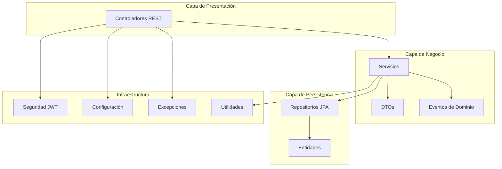
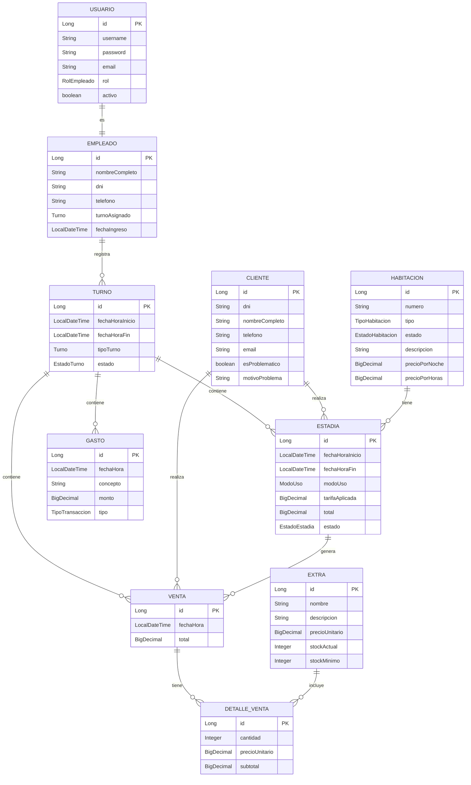
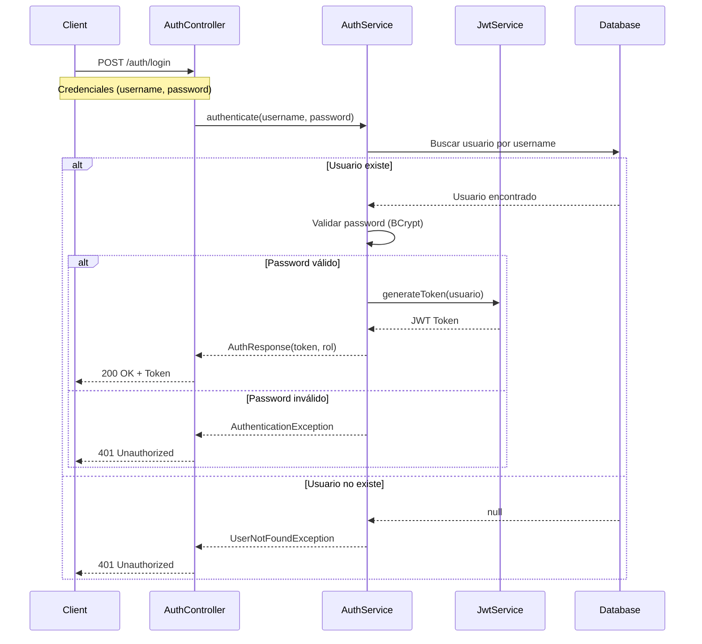
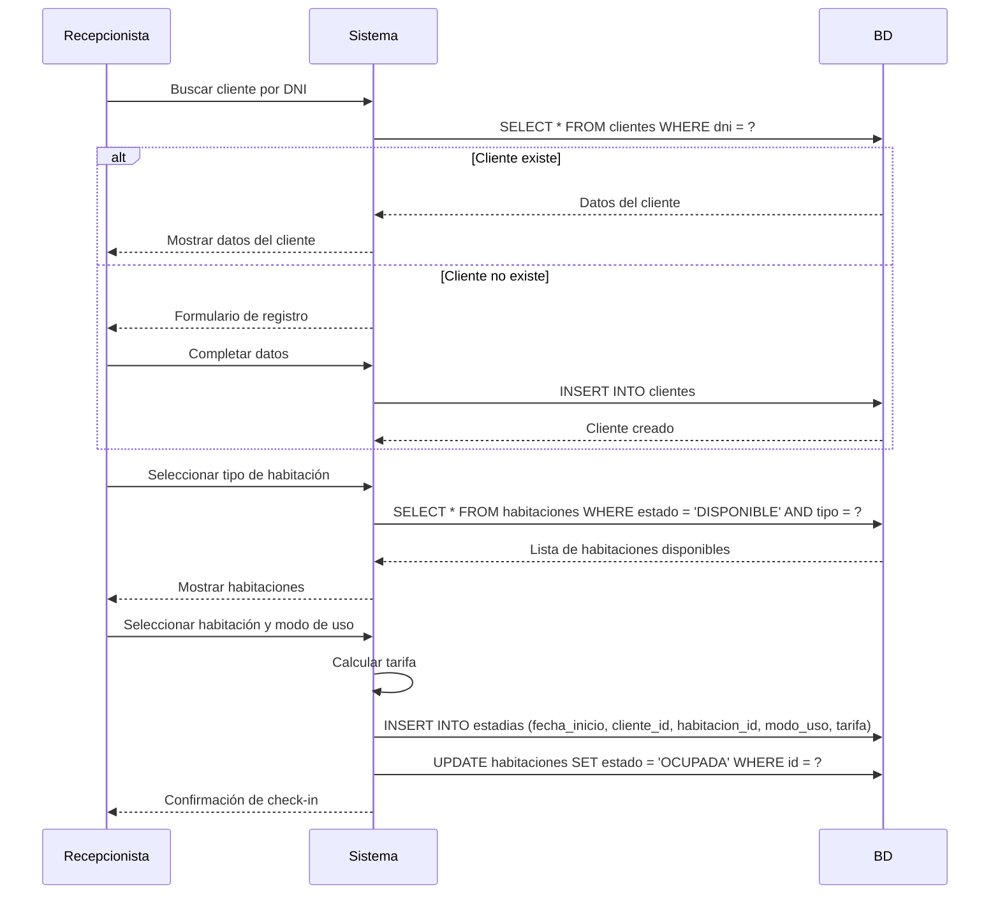
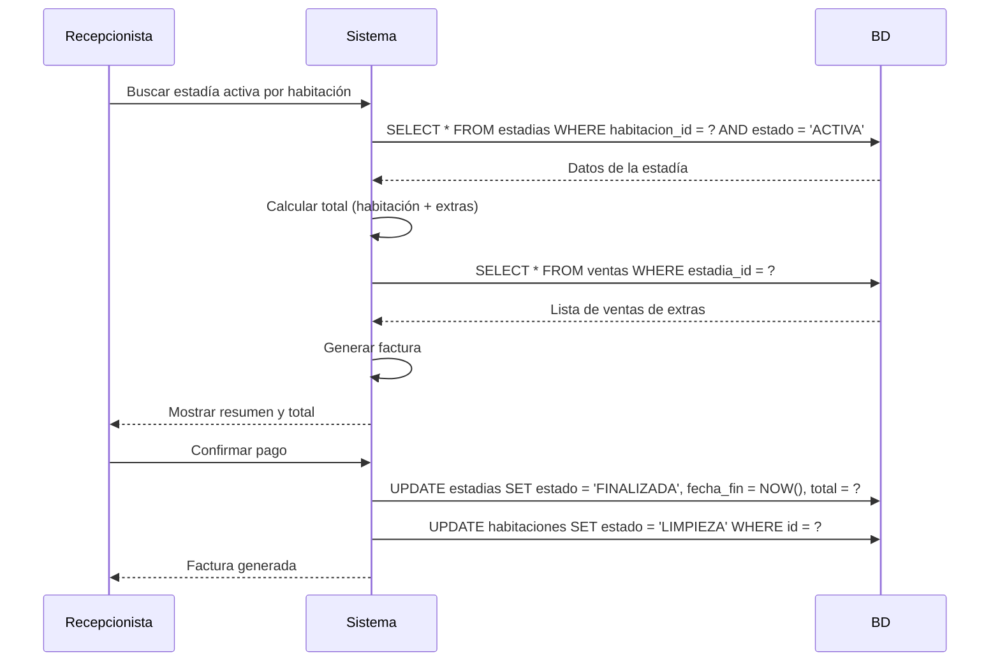
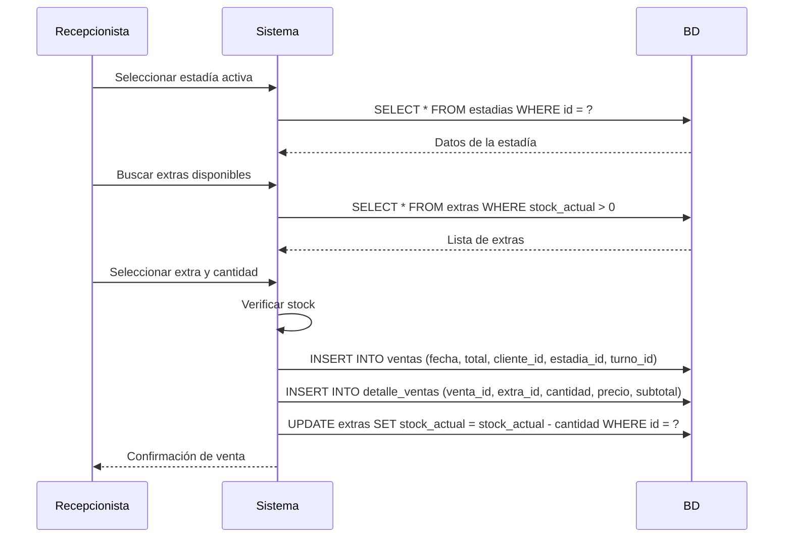
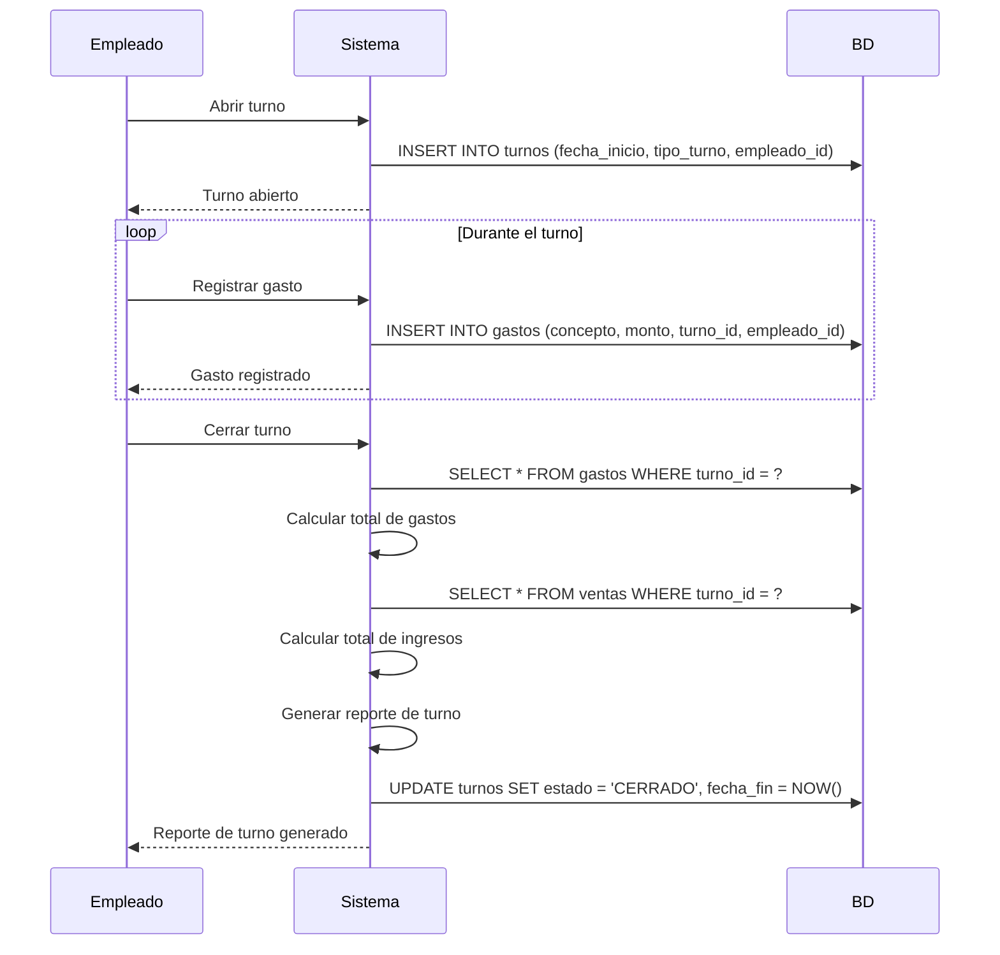
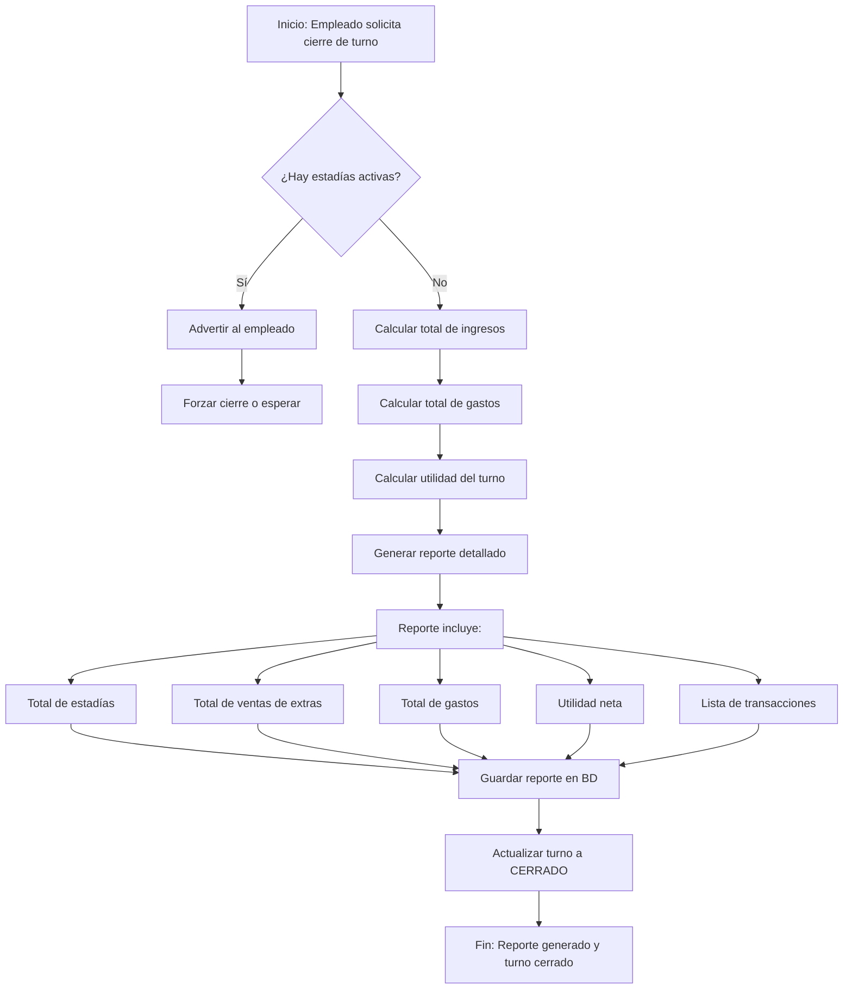

# PLAN DE PROYECTO: SISTEMA DE GESTIÓN HOTELERA (HOTEL-SYSTEM)

## 📋 ÍNDICE

1. [Arquitectura General](#-arquitectura-general)
2. [Estructura de Paquetes](#-estructura-de-paquetes)
3. [Entidades y Relaciones](#-entidades-y-relaciones)
4. [Endpoints REST](#-endpoints-rest)
5. [Seguridad](#-seguridad)
6. [Base de Datos](#-base-de-datos)
7. [Flujos de Trabajo](#-flujos-de-trabajo-principales)
8. [Tecnologías Sugeridas](#-tecnologías-sugeridas)
9. [Plan de Implementación](#-plan-de-implementación-por-fases)

---

## 🏗️ ARQUITECTURA GENERAL

### Estilo Arquitectónico

El sistema se basará en una **Arquitectura en Capas (Layered Architecture)** con una clara separación de responsabilidades:



### Patrones de Diseño Sugeridos

| Patrón | Propósito | Ejemplo de Uso |
|--------|-----------|----------------|
| **DTO** | Desacoplar capa API de dominio | `ClienteRequest`, `EstadiaResponse` |
| **Mapper (MapStruct)** | Conversión eficiente entre Entidades y DTOs | `ClienteMapper`, `EstadiaMapper` |
| **Strategy** | Cálculo de tarifas variables | `TarifaPorHoras`, `TarifaPorNoche` |
| **Repository** | Acceso a datos | `HabitacionRepository`, `ClienteRepository` |
| **Factory** | Creación de facturas/reportes | `FacturaFactory`, `ReporteFactory` |
| **Observer/Event** | Desacoplar acciones post-transacción | `CheckoutEvent`, `VentaEvent` |
| **Dependency Injection** | Inversión de control | `@Autowired`, `@Service` |

---

## 📁 ESTRUCTURA DE PAQUETES

```mermaid
graph TD
    A[com.hotel.system] --> B[config]
    A --> C[controller]
    A --> D[service]
    A --> E[repository]
    A --> F[domain]
    A --> G[exception]
    A --> H[security]
    A --> I[util]
    
    C --> CA[auth]
    C --> CH[habitacion]
    C --> CC[cliente]
    C --> CR[reserva]
    C --> CE[estadia]
    C --> CV[venta]
    C --> CG[gasto]
    C --> CT[turno]
    C --> CEMP[empleado]
    C --> CEST[estadistica]
    
    D --> DA[auth]
    D --> DH[habitacion]
    D --> DC[cliente]
    D --> DR[reserva]
    D --> DE[estadia]
    D --> DV[venta]
    D --> DG[gasto]
    D --> DT[turno]
    D --> DEMP[empleado]
    D --> DEST[estadistica]
    D --> DINV[inventario]
    
    F --> FE[entity]
    F --> FEN[enums]
    F --> FD[dto]
    
    FD --> FDR[request]
    FD --> FDS[response]
    
    H --> HJWT[JwtAuthenticationFilter]
    H --> HUD[UserDetailsServiceImpl]
    H --> HAD[CustomAccessDeniedHandler]
```



### Estructura Detallada de Paquetes

```
com.hotel.system
├── HotelSystemApplication.java
├── config
│   ├── SecurityConfig.java
│   ├── JwtConfig.java
│   ├── WebConfig.java
│   └── SwaggerConfig.java
├── controller
│   ├── auth
│   │   └── AuthController.java
│   ├── habitacion
│   │   └── HabitacionController.java
│   ├── cliente
│   │   └── ClienteController.java
│   ├── reserva
│   │   └── ReservaController.java
│   ├── estadia
│   │   └── EstadiaController.java
│   ├── venta
│   │   └── VentaController.java
│   ├── gasto
│   │   └── GastoController.java
│   ├── turno
│   │   └── TurnoController.java
│   ├── empleado
│   │   └── EmpleadoController.java
│   └── estadistica
│       └── EstadisticaController.java
├── service
│   ├── auth
│   │   ├── AuthService.java
│   │   └── JwtService.java
│   ├── habitacion
│   │   ├── HabitacionService.java
│   │   └── HabitacionServiceImpl.java
│   ├── cliente
│   │   ├── ClienteService.java
│   │   └── ClienteServiceImpl.java
│   ├── reserva
│   │   ├── ReservaService.java
│   │   └── ReservaServiceImpl.java
│   ├── estadia
│   │   ├── EstadiaService.java
│   │   └── EstadiaServiceImpl.java
│   ├── venta
│   │   ├── VentaService.java
│   │   └── VentaServiceImpl.java
│   ├── gasto
│   │   ├── GastoService.java
│   │   └── GastoServiceImpl.java
│   ├── turno
│   │   ├── TurnoService.java
│   │   └── TurnoServiceImpl.java
│   ├── empleado
│   │   ├── EmpleadoService.java
│   │   └── EmpleadoServiceImpl.java
│   ├── estadistica
│   │   ├── EstadisticaService.java
│   │   └── EstadisticaServiceImpl.java
│   └── inventario
│       ├── InventarioService.java
│       └── InventarioServiceImpl.java
├── repository
│   ├── HabitacionRepository.java
│   ├── ClienteRepository.java
│   ├── EmpleadoRepository.java
│   ├── UsuarioRepository.java
│   ├── ReservaRepository.java
│   ├── EstadiaRepository.java
│   ├── VentaRepository.java
│   ├── GastoRepository.java
│   ├── TurnoRepository.java
│   ├── ExtraRepository.java
│   └── DetalleVentaRepository.java
├── domain
│   ├── entity
│   │   ├── Habitacion.java
│   │   ├── Cliente.java
│   │   ├── Empleado.java
│   │   ├── Usuario.java
│   │   ├── Reserva.java
│   │   ├── Estadia.java
│   │   ├── Venta.java
│   │   ├── DetalleVenta.java
│   │   ├── Gasto.java
│   │   ├── Turno.java
│   │   ├── Extra.java
│   │   └── Auditoria.java
│   ├── enums
│   │   ├── TipoHabitacion.java
│   │   ├── EstadoHabitacion.java
│   │   ├── ModoUso.java
│   │   ├── Turno.java
│   │   ├── RolEmpleado.java
│   │   └── TipoTransaccion.java
│   └── dto
│       ├── request
│       │   ├── AuthRequest.java
│       │   ├── ClienteRequest.java
│       │   ├── EstadiaRequest.java
│       │   └── VentaRequest.java
│       └── response
│           ├── AuthResponse.java
│           ├── EstadiaResponse.java
│           ├── ReporteTurnoResponse.java
│           └── EstadisticasResponse.java
├── exception
│   ├── GlobalExceptionHandler.java
│   └── BusinessException.java
├── mapper
│   ├── HabitacionMapper.java
│   ├── ClienteMapper.java
│   ├── EstadiaMapper.java
│   └── ...
├── security
│   ├── JwtAuthenticationFilter.java
│   ├── UserDetailsServiceImpl.java
│   └── CustomAccessDeniedHandler.java
└── util
    ├── Constants.java
    └── DateUtils.java
```

---

## 📊 ENTIDADES Y RELACIONES

### Diagrama ER Simplificado



### Lista de Entidades con sus Atributos

#### 1. Usuario
| Atributo | Tipo | Descripción |
|----------|------|-------------|
| id | Long | Identificador único |
| username | String | Nombre de usuario (unique) |
| password | String | Contraseña hasheada |
| email | String | Correo electrónico |
| rol | RolEmpleado | ADMIN, RECEPCIONISTA, MANTENIMIENTO, GERENTE |
| activo | boolean | Indica si el usuario está activo |

#### 2. Empleado
| Atributo | Tipo | Descripción |
|----------|------|-------------|
| id | Long | Identificador único |
| nombreCompleto | String | Nombres y apellidos |
| dni | String | Documento de identidad (unique) |
| telefono | String | Número de contacto |
| turnoAsignado | Turno | MATUTINO, VESPERTINO, NOCTURNO |
| fechaIngreso | LocalDateTime | Fecha de registro en el sistema |

#### 3. Cliente
| Atributo | Tipo | Descripción |
|----------|------|-------------|
| id | Long | Identificador único |
| dni | String | Documento de identidad (unique) |
| nombreCompleto | String | Nombres y apellidos |
| telefono | String | Número de contacto |
| email | String | Correo electrónico |
| esProblematico | boolean | Flag de cliente problemático |
| motivoProblema | String | Razón de ser problemático |

#### 4. Habitacion
| Atributo | Tipo | Descripción |
|----------|------|-------------|
| id | Long | Identificador único |
| numero | String | Número de habitación (unique) |
| tipo | TipoHabitacion | PERSONAL, MATRIMONIAL, TEMATICA, DOBLE, TRIPLE |
| estado | EstadoHabitacion | DISPONIBLE, LIMPIEZA, OCUPADA, MANTENIMIENTO, RESERVADA |
| descripcion | String | Descripción de la habitación |
| precioPorNoche | BigDecimal | Tarifa por noche |
| precioPorHoras | BigDecimal | Tarifa por horas |
| caracteristicas | String | Características especiales |

#### 5. Estadia
| Atributo | Tipo | Descripción |
|----------|------|-------------|
| id | Long | Identificador único |
| fechaHoraInicio | LocalDateTime | Fecha y hora de check-in |
| fechaHoraFin | LocalDateTime | Fecha y hora de check-out |
| modoUso | ModoUso | HORAS, NOCHE |
| tarifaAplicada | BigDecimal | Tarifa que se aplicó |
| total | BigDecimal | Total a pagar |
| estado | EstadoEstadia | ACTIVA, FINALIZADA, CANCELADA |

#### 6. Venta
| Atributo | Tipo | Descripción |
|----------|------|-------------|
| id | Long | Identificador único |
| fechaHora | LocalDateTime | Fecha y hora de la venta |
| total | BigDecimal | Total de la venta |

#### 7. Extra
| Atributo | Tipo | Descripción |
|----------|------|-------------|
| id | Long | Identificador único |
| nombre | String | Nombre del producto (unique) |
| descripcion | String | Descripción del producto |
| precioUnitario | BigDecimal | Precio por unidad |
| stockActual | Integer | Cantidad en inventario |
| stockMinimo | Integer | Nivel mínimo de stock |

#### 8. Gasto
| Atributo | Tipo | Descripción |
|----------|------|-------------|
| id | Long | Identificador único |
| fechaHora | LocalDateTime | Fecha y hora del gasto |
| concepto | String | Descripción del gasto |
| monto | BigDecimal | Cantidad gastada |
| tipo | TipoTransaccion | INGRESO, GASTO |

#### 9. Turno
| Atributo | Tipo | Descripción |
|----------|------|-------------|
| id | Long | Identificador único |
| fechaHoraInicio | LocalDateTime | Inicio del turno |
| fechaHoraFin | LocalDateTime | Fin del turno |
| tipoTurno | Turno | MATUTINO, VESPERTINO, NOCTURNO |
| estado | EstadoTurno | ABIERTO, CERRADO |

### Enums Necesarios

```java
public enum TipoHabitacion {
    PERSONAL,
    MATRIMONIAL,
    TEMATICA,
    DOBLE,
    TRIPLE
}

public enum EstadoHabitacion {
    DISPONIBLE,
    LIMPIEZA,
    OCUPADA,
    MANTENIMIENTO,
    RESERVADA
}

public enum ModoUso {
    HORAS,
    NOCHE
}

public enum Turno {
    MATUTINO,
    VESPERTINO,
    NOCTURNO
}

public enum RolEmpleado {
    ADMIN,
    RECEPCIONISTA,
    MANTENIMIENTO,
    GERENTE
}

public enum TipoTransaccion {
    INGRESO,
    GASTO
}

public enum EstadoEstadia {
    ACTIVA,
    FINALIZADA,
    CANCELADA
}

public enum EstadoTurno {
    ABIERTO,
    CERRADO
}
```

---

## 🌐 ENDPOINTS REST

### Base Path: `/api/v1`

#### Autenticación
| Método | Endpoint | Descripción | Roles |
|--------|----------|-------------|-------|
| POST | `/auth/login` | Login y obtención de JWT | PUBLIC |
| POST | `/auth/register` | Registrar nuevo usuario | ADMIN |
| POST | `/auth/logout` | Cerrar sesión | AUTENTICADO |

#### Habitaciones
| Método | Endpoint | Descripción | Roles |
|--------|----------|-------------|-------|
| GET | `/habitaciones` | Listar todas las habitaciones | ADMIN, RECEPCIONISTA, GERENTE |
| GET | `/habitaciones/{id}` | Obtener habitación por ID | ADMIN, RECEPCIONISTA, GERENTE |
| GET | `/habitaciones/disponibles` | Listar habitaciones disponibles | ADMIN, RECEPCIONISTA |
| GET | `/habitaciones/tipo/{tipo}` | Filtrar por tipo de habitación | ADMIN, RECEPCIONISTA |
| POST | `/habitaciones` | Crear nueva habitación | ADMIN, GERENTE |
| PUT | `/habitaciones/{id}` | Actualizar habitación | ADMIN, GERENTE |
| PUT | `/habitaciones/{id}/estado` | Actualizar estado de habitación | ADMIN, RECEPCIONISTA, MANTENIMIENTO |
| DELETE | `/habitaciones/{id}` | Eliminar habitación | ADMIN |

#### Clientes
| Método | Endpoint | Descripción | Roles |
|--------|----------|-------------|-------|
| GET | `/clientes` | Listar clientes (paginado) | ADMIN, RECEPCIONISTA |
| GET | `/clientes/{id}` | Obtener cliente por ID | ADMIN, RECEPCIONISTA |
| GET | `/clientes/search` | Buscar por DNI o nombre | ADMIN, RECEPCIONISTA |
| GET | `/clientes/historial/{id}` | Historial de estadías del cliente | ADMIN, RECEPCIONISTA |
| POST | `/clientes` | Registrar nuevo cliente | ADMIN, RECEPCIONISTA |
| PUT | `/clientes/{id}` | Actualizar cliente | ADMIN, RECEPCIONISTA |
| PUT | `/clientes/{id}/problematico` | Marcar/desmarcar como problemático | ADMIN, GERENTE |

#### Estadías (Check-in/out)
| Método | Endpoint | Descripción | Roles |
|--------|----------|-------------|-------|
| POST | `/estadias/checkin` | Realizar check-in | ADMIN, RECEPCIONISTA |
| PUT | `/estadias/{id}/checkout` | Realizar check-out y facturar | ADMIN, RECEPCIONISTA |
| GET | `/estadias` | Listar estadías | ADMIN, RECEPCIONISTA |
| GET | `/estadias/activas` | Listar estadías activas | ADMIN, RECEPCIONISTA |
| GET | `/estadias/{id}` | Obtener detalle de estadía | ADMIN, RECEPCIONISTA |
| GET | `/estadias/cliente/{clienteId}` | Historial de estadías por cliente | ADMIN, RECEPCIONISTA |

#### Ventas (Extras)
| Método | Endpoint | Descripción | Roles |
|--------|----------|-------------|-------|
| GET | `/extras` | Listar catálogo de extras | ADMIN, RECEPCIONISTA |
| GET | `/extras/{id}` | Obtener extra por ID | ADMIN, RECEPCIONISTA |
| POST | `/extras` | Crear nuevo extra | ADMIN, GERENTE |
| PUT | `/extras/{id}` | Actualizar extra | ADMIN, GERENTE |
| PUT | `/extras/{id}/stock` | Actualizar stock | ADMIN, GERENTE |
| DELETE | `/extras/{id}` | Eliminar extra | ADMIN |
| POST | `/ventas` | Registrar venta de extras | ADMIN, RECEPCIONISTA |
| GET | `/ventas` | Listar ventas | ADMIN, GERENTE |
| GET | `/ventas/{id}` | Obtener venta por ID | ADMIN, GERENTE |

#### Gastos
| Método | Endpoint | Descripción | Roles |
|--------|----------|-------------|-------|
| POST | `/gastos` | Registrar un gasto | ADMIN, GERENTE |
| GET | `/gastos` | Listar gastos | ADMIN, GERENTE |
| GET | `/gastos/{id}` | Obtener gasto por ID | ADMIN, GERENTE |
| GET | `/gastos/turno/{turnoId}` | Gastos por turno | ADMIN, GERENTE |

#### Turnos
| Método | Endpoint | Descripción | Roles |
|--------|----------|-------------|-------|
| POST | `/turnos/abrir` | Abrir un turno | ADMIN, RECEPCIONISTA |
| PUT | `/turnos/{id}/cerrar` | Cerrar turno y generar reporte | ADMIN, RECEPCIONISTA |
| GET | `/turnos` | Listar turnos | ADMIN, GERENTE |
| GET | `/turnos/{id}` | Obtener turno por ID | ADMIN, GERENTE |
| GET | `/turnos/{id}/reporte` | Reporte detallado de turno | ADMIN, GERENTE |

#### Empleados
| Método | Endpoint | Descripción | Roles |
|--------|----------|-------------|-------|
| POST | `/empleados` | Registrar empleado | ADMIN |
| PUT | `/empleados/{id}` | Actualizar datos del empleado | ADMIN |
| GET | `/empleados` | Listar empleados | ADMIN, GERENTE |
| GET | `/empleados/{id}` | Obtener empleado por ID | ADMIN, GERENTE |
| DELETE | `/empleados/{id}` | Desactivar empleado | ADMIN |

#### Estadísticas
| Método | Endpoint | Descripción | Roles |
|--------|----------|-------------|-------|
| GET | `/estadisticas/resumen` | Resumen general (KPIs) | ADMIN, GERENTE |
| GET | `/estadisticas/ingresos-gastos` | Ingresos vs Gastos por rango | ADMIN, GERENTE |
| GET | `/estadisticas/ocupacion` | Porcentaje de ocupación | ADMIN, GERENTE |
| GET | `/estadisticas/top-extras` | Top extras más vendidos | ADMIN, GERENTE |
| GET | `/estadisticas/habitacion-rentable` | Habitación más rentable | ADMIN, GERENTE |
| GET | `/estadisticas/promedio-estadia` | Promedio de estadía por tipo | ADMIN, GERENTE |
| GET | `/estadisticas/turno-mas-ventas` | Turno con más ventas | ADMIN, GERENTE |

---

## 🔒 SEGURIDAD

### Diagrama de Flujo de Autenticación



### Estructura de Seguridad

```mermaid
graph TD
    A[Cliente] -->|Request + JWT| B[Filtro JWT]
    B -->|Validar Token| C[JwtService]
    C -->|Token Válido| D[Establecer Autenticación]
    D --> E[Controller]
    E -->|@PreAuthorize| F[Verificar Roles]
    F -->|Permitido| G[Ejecutar Lógica]
    F -->|Denegado| H[403 Forbidden]
    
    I[Usuario no autenticado] -->|Request sin JWT| J[SecurityConfig]
    J -->|Redirigir| K[Login Endpoint]
```

### Roles y Permisos

| Rol | Habitaciones | Clientes | Estadías | Ventas | Gastos | Turnos | Empleados | Estadísticas |
|-----|--------------|----------|----------|--------|--------|--------|-----------|--------------|
| **ADMIN** | CRUD | CRUD | CRUD | CRUD | CRUD | CRUD | CRUD | VER |
| **GERENTE** | VER, ACTUALIZAR | VER, ACTUALIZAR | VER | VER, REGISTRAR | CREAR, VER | VER | VER | VER |
| **RECEPCIONISTA** | VER, ACT. ESTADO | CRUD | CREAR, VER, ACT. | CREAR, VER | NO | CREAR, CERRAR | NO | NO |
| **MANTENIMIENTO** | ACT. ESTADO | NO | NO | NO | NO | VER | NO | NO |

### Permisos por Endpoint (Ejemplo)

```java
@RestController
@RequestMapping("/api/v1/habitaciones")
public class HabitacionController {
    
    @GetMapping
    @PreAuthorize("hasAnyRole('ADMIN', 'RECEPCIONISTA', 'GERENTE')")
    public ResponseEntity<List<HabitacionResponse>> listarHabitaciones() { ... }
    
    @PostMapping
    @PreAuthorize("hasAnyRole('ADMIN', 'GERENTE')")
    public ResponseEntity<HabitacionResponse> crearHabitacion(@RequestBody HabitacionRequest request) { ... }
    
    @PutMapping("/{id}/estado")
    @PreAuthorize("hasAnyRole('ADMIN', 'RECEPCIONISTA', 'MANTENIMIENTO')")
    public ResponseEntity<Void> actualizarEstado(@PathVariable Long id, @RequestBody EstadoRequest request) { ... }
}
```

---

## 🗄️ BASE DE DATOS

### Motor de Base de Datos
- **PostgreSQL 14+** (recomendado por su robustez y rendimiento)
- Alternativa: MySQL 8+

### Migraciones con Flyway

```
src/main/resources/db/migration/
├── V1__create_initial_tables.sql
├── V2__insert_roles_and_users.sql
├── V3__insert_habitaciones.sql
├── V4__insert_extras.sql
└── ...
```

### Script de Estructura (V1__create_initial_tables.sql)

```sql
-- =====================================================
-- SISTEMA DE GESTIÓN HOTELERA - TABLAS PRINCIPALES
-- =====================================================

-- 1. TABLA DE EMPLEADOS
CREATE TABLE empleados (
    id BIGSERIAL PRIMARY KEY,
    nombre_completo VARCHAR(100) NOT NULL,
    dni VARCHAR(20) UNIQUE NOT NULL,
    telefono VARCHAR(20),
    turno_asignado VARCHAR(20) NOT NULL,
    fecha_ingreso TIMESTAMP NOT NULL DEFAULT CURRENT_TIMESTAMP,
    activo BOOLEAN DEFAULT TRUE
);

-- 2. TABLA DE USUARIOS (Autenticación)
CREATE TABLE usuarios (
    id BIGSERIAL PRIMARY KEY,
    username VARCHAR(50) UNIQUE NOT NULL,
    password VARCHAR(255) NOT NULL,
    email VARCHAR(100) NOT NULL,
    rol VARCHAR(30) NOT NULL,
    empleado_id BIGINT UNIQUE,
    activo BOOLEAN DEFAULT TRUE,
    FOREIGN KEY (empleado_id) REFERENCES empleados(id) ON DELETE SET NULL
);

-- 3. TABLA DE CLIENTES
CREATE TABLE clientes (
    id BIGSERIAL PRIMARY KEY,
    dni VARCHAR(20) UNIQUE NOT NULL,
    nombre_completo VARCHAR(100) NOT NULL,
    telefono VARCHAR(20),
    email VARCHAR(100),
    es_problematico BOOLEAN DEFAULT FALSE,
    motivo_problema TEXT,
    fecha_registro TIMESTAMP DEFAULT CURRENT_TIMESTAMP
);

-- 4. TABLA DE HABITACIONES
CREATE TABLE habitaciones (
    id BIGSERIAL PRIMARY KEY,
    numero VARCHAR(10) UNIQUE NOT NULL,
    tipo VARCHAR(20) NOT NULL,
    estado VARCHAR(20) NOT NULL DEFAULT 'DISPONIBLE',
    descripcion TEXT,
    precio_por_noche DECIMAL(10,2) NOT NULL,
    precio_por_horas DECIMAL(10,2),
    caracteristicas TEXT,
    fecha_creacion TIMESTAMP DEFAULT CURRENT_TIMESTAMP
);

-- 5. TABLA DE TURNOS
CREATE TABLE turnos (
    id BIGSERIAL PRIMARY KEY,
    fecha_hora_inicio TIMESTAMP NOT NULL,
    fecha_hora_fin TIMESTAMP,
    tipo_turno VARCHAR(20) NOT NULL,
    empleado_id BIGINT NOT NULL,
    estado VARCHAR(20) DEFAULT 'ABIERTO',
    FOREIGN KEY (empleado_id) REFERENCES empleados(id),
    CONSTRAINT chk_estado_turno CHECK (estado IN ('ABIERTO', 'CERRADO'))
);

-- 6. TABLA DE ESTADÍAS (Check-in/out)
CREATE TABLE estadias (
    id BIGSERIAL PRIMARY KEY,
    fecha_hora_inicio TIMESTAMP NOT NULL,
    fecha_hora_fin TIMESTAMP,
    modo_uso VARCHAR(10) NOT NULL,
    tarifa_aplicada DECIMAL(10,2) NOT NULL,
    total DECIMAL(10,2),
    cliente_id BIGINT NOT NULL,
    habitacion_id BIGINT NOT NULL,
    turno_id BIGINT NOT NULL,
    estado VARCHAR(20) DEFAULT 'ACTIVA',
    FOREIGN KEY (cliente_id) REFERENCES clientes(id),
    FOREIGN KEY (habitacion_id) REFERENCES habitaciones(id),
    FOREIGN KEY (turno_id) REFERENCES turnos(id),
    CONSTRAINT chk_estado_estadia CHECK (estado IN ('ACTIVA', 'FINALIZADA', 'CANCELADA'))
);

-- 7. TABLA DE EXTRAS (Catálogo)
CREATE TABLE extras (
    id BIGSERIAL PRIMARY KEY,
    nombre VARCHAR(100) UNIQUE NOT NULL,
    descripcion TEXT,
    precio_unitario DECIMAL(10,2) NOT NULL,
    stock_actual INTEGER NOT NULL DEFAULT 0,
    stock_minimo INTEGER DEFAULT 5,
    activo BOOLEAN DEFAULT TRUE
);

-- 8. TABLA DE VENTAS
CREATE TABLE ventas (
    id BIGSERIAL PRIMARY KEY,
    fecha_hora TIMESTAMP NOT NULL,
    total DECIMAL(10,2) NOT NULL,
    cliente_id BIGINT NOT NULL,
    estadia_id BIGINT,
    turno_id BIGINT NOT NULL,
    empleado_id BIGINT NOT NULL,
    FOREIGN KEY (cliente_id) REFERENCES clientes(id),
    FOREIGN KEY (estadia_id) REFERENCES estadias(id),
    FOREIGN KEY (turno_id) REFERENCES turnos(id),
    FOREIGN KEY (empleado_id) REFERENCES empleados(id)
);

-- 9. TABLA DE DETALLE DE VENTAS
CREATE TABLE detalle_ventas (
    id BIGSERIAL PRIMARY KEY,
    venta_id BIGINT NOT NULL,
    extra_id BIGINT NOT NULL,
    cantidad INTEGER NOT NULL,
    precio_unitario DECIMAL(10,2) NOT NULL,
    subtotal DECIMAL(10,2) NOT NULL,
    FOREIGN KEY (venta_id) REFERENCES ventas(id),
    FOREIGN KEY (extra_id) REFERENCES extras(id)
);

-- 10. TABLA DE GASTOS
CREATE TABLE gastos (
    id BIGSERIAL PRIMARY KEY,
    fecha_hora TIMESTAMP NOT NULL,
    concepto VARCHAR(255) NOT NULL,
    monto DECIMAL(10,2) NOT NULL,
    tipo VARCHAR(20) NOT NULL,
    turno_id BIGINT NOT NULL,
    empleado_id BIGINT NOT NULL,
    FOREIGN KEY (turno_id) REFERENCES turnos(id),
    FOREIGN KEY (empleado_id) REFERENCES empleados(id),
    CONSTRAINT chk_tipo_gasto CHECK (tipo IN ('INGRESO', 'GASTO'))
);

-- 11. TABLA DE RESERVAS (Opcional)
CREATE TABLE reservas (
    id BIGSERIAL PRIMARY KEY,
    fecha_reserva TIMESTAMP NOT NULL,
    fecha_inicio DATE NOT NULL,
    fecha_fin DATE NOT NULL,
    cliente_id BIGINT NOT NULL,
    habitacion_id BIGINT NOT NULL,
    estado VARCHAR(20) DEFAULT 'PENDIENTE',
    total_estimado DECIMAL(10,2),
    FOREIGN KEY (cliente_id) REFERENCES clientes(id),
    FOREIGN KEY (habitacion_id) REFERENCES habitaciones(id),
    CONSTRAINT chk_estado_reserva CHECK (estado IN ('PENDIENTE', 'CONFIRMADA', 'CANCELADA', 'FINALIZADA'))
);

-- Índices para mejorar el rendimiento
CREATE INDEX idx_estadias_cliente_id ON estadias(cliente_id);
CREATE INDEX idx_estadias_habitacion_id ON estadias(habitacion_id);
CREATE INDEX idx_estadias_turno_id ON estadias(turno_id);
CREATE INDEX idx_ventas_fecha_hora ON ventas(fecha_hora);
CREATE INDEX idx_gastos_fecha_hora ON gastos(fecha_hora);
CREATE INDEX idx_turnos_fecha_inicio ON turnos(fecha_hora_inicio);
```

---

## 🔄 FLUJOS DE TRABAJO PRINCIPALES

### 1. Check-in de un Cliente



### 2. Check-out y Facturación



### 3. Venta de Extras durante la Estadía



### 4. Registro de Gastos por Turno



### 5. Cierre de Turno y Reporte



---

## 🛠️ TECNOLOGÍAS SUGERIDAS

| Componente | Tecnología | Versión / Notas |
|------------|------------|-----------------|
| **Framework Base** | Spring Boot | 3.1.x o superior |
| **Lenguaje** | Java | 17 o superior (LTS) |
| **Gestor de Dependencias** | Maven | 3.8+ o Gradle |
| **Base de Datos** | PostgreSQL | 14+ |
| **ORM** | Spring Data JPA (Hibernate) | - |
| **Migraciones DB** | Flyway | 9.x |
| **Seguridad** | Spring Security + JWT | JJWT para generación/validación |
| **Mapeo DTOs** | MapStruct | 1.5.x |
| **Documentación API** | Springdoc OpenAPI (Swagger) | 2.x |
| **Validación** | Jakarta Bean Validation (Hibernate Validator) | - |
| **Logging** | SLF4J + Logback | - |
| **Testing** | JUnit 5, Mockito, Testcontainers | - |
| **Monitoreo** | Spring Boot Actuator, Micrometer | Opcional |
| **Empaquetado** | JAR | - |

### Dependencias Maven Clave

```xml
<dependencies>
    <!-- Spring Boot Starters -->
    <dependency>
        <groupId>org.springframework.boot</groupId>
        <artifactId>spring-boot-starter-web</artifactId>
    </dependency>
    <dependency>
        <groupId>org.springframework.boot</groupId>
        <artifactId>spring-boot-starter-data-jpa</artifactId>
    </dependency>
    <dependency>
        <groupId>org.springframework.boot</groupId>
        <artifactId>spring-boot-starter-security</artifactId>
    </dependency>
    <dependency>
        <groupId>org.springframework.boot</groupId>
        <artifactId>spring-boot-starter-validation</artifactId>
    </dependency>

    <!-- JWT -->
    <dependency>
        <groupId>io.jsonwebtoken</groupId>
        <artifactId>jjwt-api</artifactId>
        <version>0.11.5</version>
    </dependency>
    <dependency>
        <groupId>io.jsonwebtoken</groupId>
        <artifactId>jjwt-impl</artifactId>
        <version>0.11.5</version>
        <scope>runtime</scope>
    </dependency>
    <dependency>
        <groupId>io.jsonwebtoken</groupId>
        <artifactId>jjwt-jackson</artifactId>
        <version>0.11.5</version>
        <scope>runtime</scope>
    </dependency>

    <!-- MapStruct -->
    <dependency>
        <groupId>org.mapstruct</groupId>
        <artifactId>mapstruct</artifactId>
        <version>1.5.5.Final</version>
    </dependency>
    <dependency>
        <groupId>org.mapstruct</groupId>
        <artifactId>mapstruct-processor</artifactId>
        <version>1.5.5.Final</version>
        <scope>provided</scope>
    </dependency>

    <!-- Base de Datos -->
    <dependency>
        <groupId>org.postgresql</groupId>
        <artifactId>postgresql</artifactId>
        <scope>runtime</scope>
    </dependency>

    <!-- Documentación API -->
    <dependency>
        <groupId>org.springdoc</groupId>
        <artifactId>springdoc-openapi-starter-webmvc-ui</artifactId>
        <version>2.2.0</version>
    </dependency>

    <!-- Actuator -->
    <dependency>
        <groupId>org.springframework.boot</groupId>
        <artifactId>spring-boot-starter-actuator</artifactId>
    </dependency>

    <!-- Testing -->
    <dependency>
        <groupId>org.springframework.boot</groupId>
        <artifactId>spring-boot-starter-test</artifactId>
        <scope>test</scope>
    </dependency>
</dependencies>
```

### Configuración application.yml

```yaml
spring:
  application:
    name: hotel-system
  
  datasource:
    url: jdbc:postgresql://localhost:5432/hotel_db
    username: hotel_user
    password: hotel_password
    driver-class-name: org.postgresql.Driver
  
  jpa:
    hibernate:
      ddl-auto: validate
    properties:
      hibernate:
        dialect: org.hibernate.dialect.PostgreSQLDialect
        format_sql: true
    show-sql: false
  
  flyway:
    enabled: true
    baseline-on-migrate: true
  
  security:
    jwt:
      secret: ${JWT_SECRET:your-256-bit-secret-key-for-jwt-signing}
      expiration: 86400000 # 24 horas en milisegundos
  
server:
  port: 8080
  servlet:
    context-path: /api

logging:
  level:
    com.hotel.system: DEBUG
    org.springframework.security: INFO
```

---

## 📋 PLAN DE IMPLEMENTACIÓN POR FASES

### Fase 1: Core (Infraestructura y Entidades Fundamentales)
**Duración Estimada:** 1 semana

| Tarea | Descripción | Entregable |
|-------|-------------|------------|
| 1.1 | Configuración del proyecto Spring Boot | Proyecto base con dependencias |
| 1.2 | Configuración de PostgreSQL y Flyway | Conexión a BD funcionando |
| 1.3 | Creación de scripts de migración iniciales | Tablas: Usuario, Empleado, Cliente, Habitacion |
| 1.4 | Implementación de entidades JPA | Entidades con anotaciones JPA |
| 1.5 | Configuración de Spring Security con JWT | Login y registro funcionando |
| 1.6 | CRUD básico de Habitacion, Cliente y Empleado | Endpoints básicos funcionando |
| 1.7 | Pruebas unitarias de repositorios y servicios | Tests unitarios pasando |

### Fase 2: Lógica de Negocio (Reservas, Check-in/out)
**Duración Estimada:** 1.5 semanas

| Tarea | Descripción | Entregable |
|-------|-------------|------------|
| 2.1 | Implementación de entidad Estadia | Entidad Estadia y repositorio |
| 2.2 | Desarrollo de servicios de Check-in/out | Lógica de negocio de estadías |
| 2.3 | Implementación de cálculo de tarifas (Strategy) | Estrategias de cálculo |
| 2.4 | Integración con cambio de estado de habitaciones | Actualización automática de estados |
| 2.5 | Endpoints de búsqueda de clientes y habitaciones | Búsquedas optimizadas |
| 2.6 | Gestión básica de turnos (apertura/cierre) | Turnos funcionando |
| 2.7 | Pruebas de integración de flujo de check-in/out | Pruebas de integración pasando |

### Fase 3: Módulos Complementarios (Ventas, Gastos, Turnos)
**Duración Estimada:** 2 semanas

| Tarea | Descripción | Entregable |
|-------|-------------|------------|
| 3.1 | Catálogo de extras y gestión de inventario | CRUD de extras completo |
| 3.2 | Sistema de ventas y registro de detalles | Ventas con descuento de stock |
| 3.3 | Integración de ventas con estadías | Suma de extras al total de estadía |
| 3.4 | Módulo de gastos | Registro y consulta de gastos |
| 3.5 | Mejora de turnos con asociaciones | Ventas y gastos asociados a turnos |
| 3.6 | Reporte de cierre de turno | Generación de reportes |
| 3.7 | Lógica de "clientes problemáticos" | Flag y motivo en clientes |
| 3.8 | Pruebas funcionales | Pruebas de módulos completos |

### Fase 4: Estadísticas y Reportes
**Duración Estimada:** 1 semana

| Tarea | Descripción | Entregable |
|-------|-------------|------------|
| 4.1 | Servicios de consulta para estadísticas | Servicios de estadísticas |
| 4.2 | Endpoints para todos los KPIs | Endpoints de estadísticas |
| 4.3 | Implementación de filtros por fecha/turno | Filtros funcionando |
| 4.4 | Optimización de consultas SQL/JPQL | Consultas optimizadas |
| 4.5 | Generación de reportes en PDF/Excel (opcional) | Reportes exportables |
| 4.6 | Pruebas de rendimiento | Validación de rendimiento |
| 4.7 | Documentación de la API con Swagger | Documentación completa |

### Fase 5: Despliegue y Puesta a Punto
**Duración Estimada:** 3-5 días

| Tarea | Descripción | Entregable |
|-------|-------------|------------|
| 5.1 | Configuración de perfiles de entorno | application-dev.yml, application-prod.yml |
| 5.2 | Pruebas de aceptación (UAT) | Validación con cliente |
| 5.3 | Corrección de errores críticos | Issues resueltos |
| 5.4 | Preparación del artefacto para despliegue | JAR listo para producción |
| 5.5 | Documentación de usuario | Manual de usuario |
| 5.6 | Manual de instalación y despliegue | Guía de despliegue |
| 5.7 | Despliegue en entorno de producción | Sistema en producción |

---

## 📝 RESUMEN EJECUTIVO

| Aspecto | Detalle |
|---------|---------|
| **Proyecto** | Sistema de Gestión Hotelera |
| **Arquitectura** | Capas (Controller-Service-Repository) |
| **Backend** | Java 17 + Spring Boot 3.1+ |
| **Base de Datos** | PostgreSQL 14+ con Flyway |
| **Seguridad** | Spring Security + JWT |
| **API** | RESTful con documentación Swagger |
| **Tiempo Estimado** | 6-7 semanas (aprox.) |
| **Equipo Recomendado** | 2-3 desarrolladores backend |

---